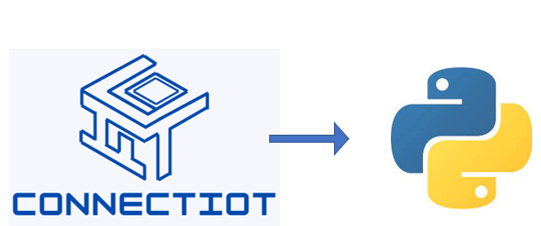

# ConnectIoT Python Library

>### This library allows the interaction between ConnectIoT smart contract project and Python scripts.

---

## Features

- Create/Delete a registry 
- Add/Delete a device to registry
- Set/Get device data
- Set/Get device metadata
- Set/Get device data parmeters
- Set/Get device metadata parmeters

_See [documentation](docs/README.md#connectiot-python-library) for more info and [examples](example/main.py)_

---

## Requirements

- [NEAR Account](https://docs.near.org/concepts/basics/account) _(with access to private key or seed phrase)_
- [ConnectIoT-API](https://github.com/paul-cruz/ConnectIoT-API.git) (*This allows you to connect with the ConnectIoT smart contract for example an ip with its port*)

---
## Credits

>
  

  

---

## Support

Reach out via [website](https://mexbalia.com/contact/) or send an email to [info@mexbalia.com](https://google.com)
